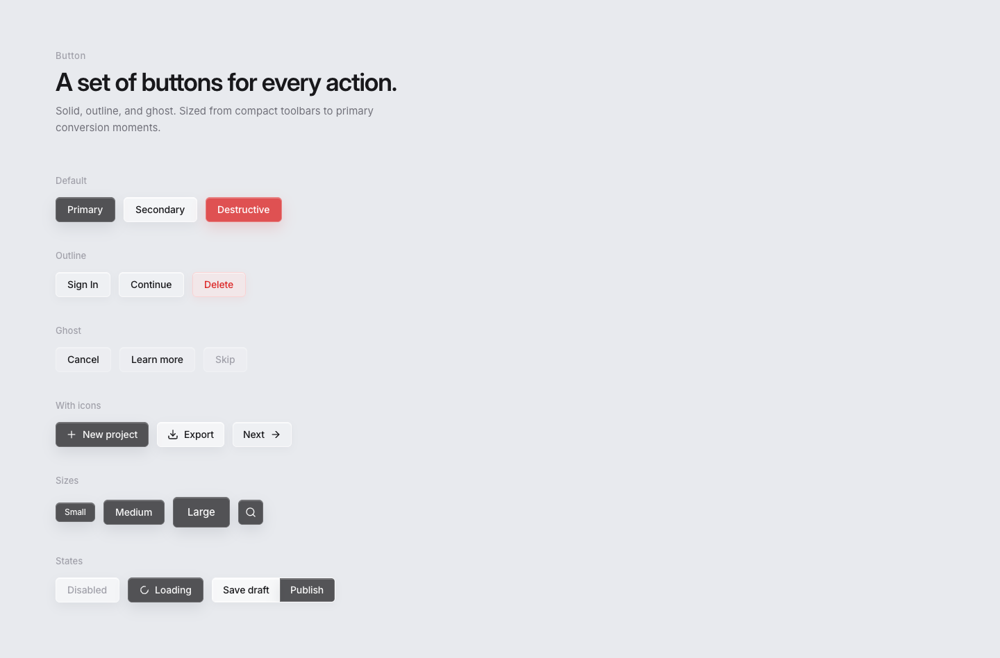

# Docs

Glassy UI is a shadcn-shaped component kit for native [GPUI](https://github.com/zed-industries/zed). Paper is the visual contract. This folder is how you use the crate.

| Guide | What it covers |
| --- | --- |
| [Getting started](./getting-started.md) | Pin GPUI, install assets, init, first window |
| [Components](./components.md) | Public types, variants, and copy-paste examples |
| [Forms](./forms.md) | Controlled vs gallery state, Input, Select, Label |
| [Overlays](./overlays.md) | Dialog, alert, popover, tooltip, dropdown, context menu |
| [Theme and chrome](./theme.md) | Semantic tokens, materials, motion, icons |

Also at the repo root:

- [`DESIGN.md`](../DESIGN.md) — pixels, glass, type, light/dark
- [`PLAN.md`](../PLAN.md) — shipped vs Paper-ready queue

## Paper preview

Every Paper page is captured in the component, form, or overlay guide. The source artboards include both light and dark specimens.

| Light | Dark |
| --- | --- |
|  |  |
