# Forms

Form controls are gallery-friendly without a parent entity, and app-friendly when you pass a listener.

## Who owns state

| Situation | What happens |
| --- | --- |
| No `on_change` / `on_click` | The control keeps keyed state. Props seed it. Later prop changes still apply if they differ from the last seen prop. |
| `on_change` or `on_click` is set | The control is **controlled**. Paint from the props you pass this frame. Update your entity in the listener, then pass the new value back. |

If the listener does not update parent state, the control stays where the props say. That is how you refuse a toggle.

Stable `id`s are required. Keyed state, focus, and test selectors all key off them.

## Checkbox

```rust
Checkbox::new("snap")
    .label("Snap to pixel")
    .state(self.snap) // or .checked(true)
    .on_change(cx.listener(|this, state, _, cx| {
        this.snap = state;
        cx.notify();
    }))
```

`CheckState` is `Off`, `On`, or `Mixed`. Click / Space / Enter: Off → On → Off. Mixed → On. `.checked(false)` clears the mark.

## Switch

```rust
Switch::new("autosave")
    .label("Auto-save")
    .on(self.autosave)
    .on_change(cx.listener(|this, on, _, cx| {
        this.autosave = on;
        cx.notify();
    }))
```

36×20 pill. Fill is immediate. Thumb eases 180ms.

## Radio

Radios that share `.group("export")` keep one selection when uncontrolled. With a listener, `.selected(bool)` is the source of truth.

```rust
Radio::new("png")
    .group("export")
    .label("PNG")
    .selected(self.format == "png")
    .on_change(cx.listener(|this, id, _, cx| {
        this.format = id.clone();
        cx.notify();
    }))
```

## Input and textarea

```rust
Input::new("email")
    .placeholder("name@studio.dev")
    .value(self.email.clone())
    .invalid(self.email_error)
    .helper("Use a work address")
    .on_change(cx.listener(|this, value, _, cx| {
        this.email = value;
        cx.notify();
    }))

textarea("notes")
    .placeholder("Write a short description")
    .value(self.notes.clone())
    .on_change(cx.listener(|this, value, _, cx| {
        this.notes = value;
        cx.notify();
    }))
```

- Default field is 280×36. Textarea is 320×96, line-height 20.
- `.invalid(true)` paints the invalid glass and shows helper in `destructive`.
- `.show_focus(true)` is a specimen switch: it paints the focus ring without window focus.
- Call `glassy_ui::init(cx)` once or Backspace / arrows / paste will not bind.
- Textarea wrap is visual. The caret is still a single shaped line.

Without `on_change`, typing is kept internally. Parent `.value(...)` is applied when that prop changes.

## Select

```rust
Select::new("format")
    .placeholder("Choose format")
    .value("PNG")
    .items([
        SelectItem::new("PNG"),
        SelectItem::new("SVG"),
        SelectItem::new("PDF").disabled(true),
    ])
    .on_select(cx.listener(|this, value, _, cx| {
        this.format = value.clone();
        cx.notify();
    }))
```

- `.open(true)` is **controlled** (Popover-style). The Paper “Open” specimen stays open.
- `.default_open(true)` seeds an uncontrolled list.
- Popup keeps an 8px gap under the trigger. Escape and outside click dismiss.
- Arrows skip disabled rows. Enter / Space pick.

## Label

Sits above the field, never inside it. 13/500. `.required(true)` adds a destructive `*`. `.optional(true)` adds 12/500 “Optional”.

```rust
Label::new("Email")
    .required(true)
    .focus_handle(field_focus) // click focuses that handle
```

Give the label an `.id(...)` if two “Email” labels share a tree.

## Keyboard and roles

Checkbox, Switch, and Radio are Tab stops with a 3px focus ring. Space and Enter activate. Input is `TextInput`. Select is `ComboBox` with `aria-expanded`.

## Paper screenshots

### Inputs and textareas

| Light | Dark |
| --- | --- |
| 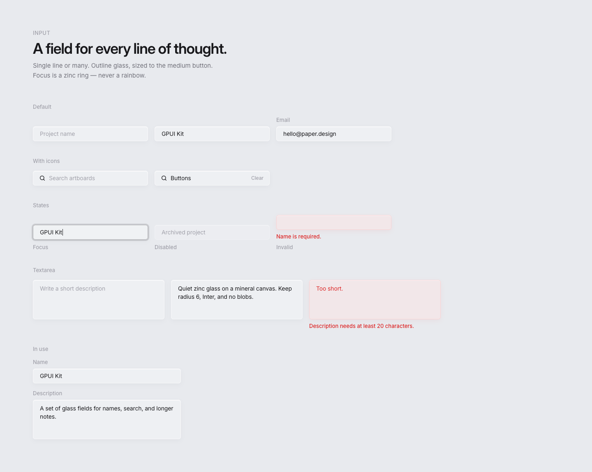 | 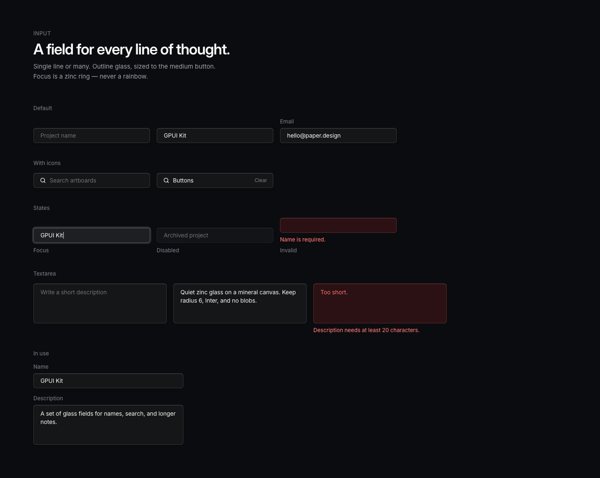 |

### Selects

| Light | Dark |
| --- | --- |
| 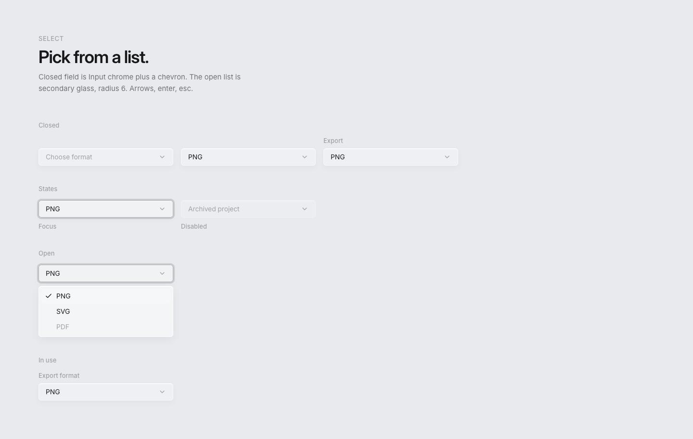 | 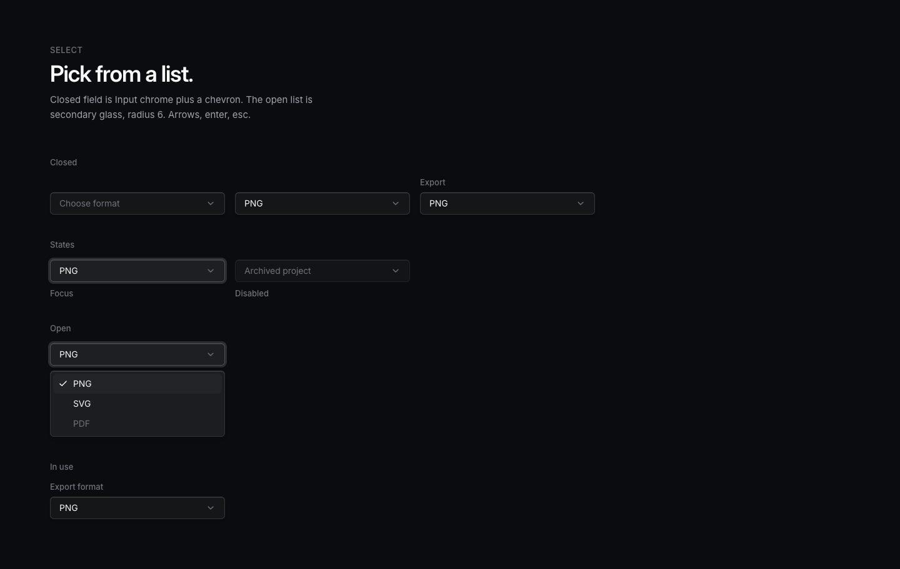 |

### Switches

| Light | Dark |
| --- | --- |
| 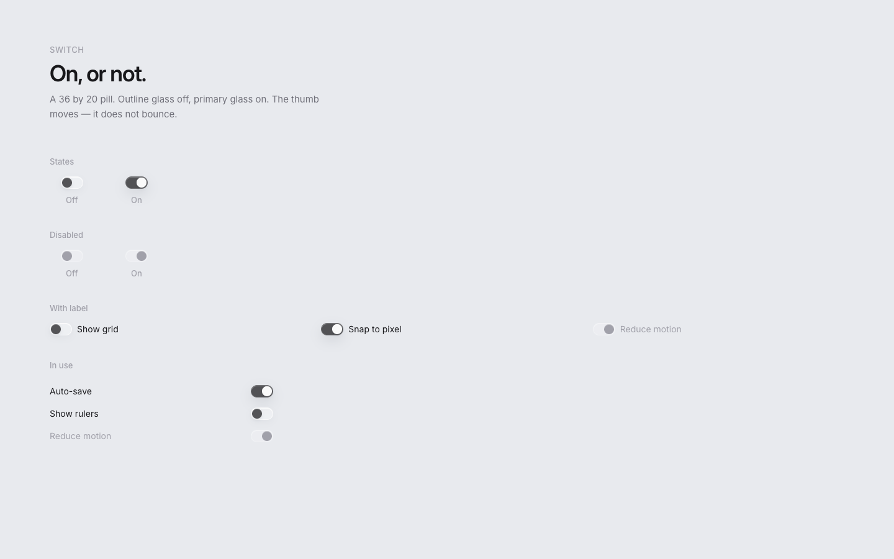 | 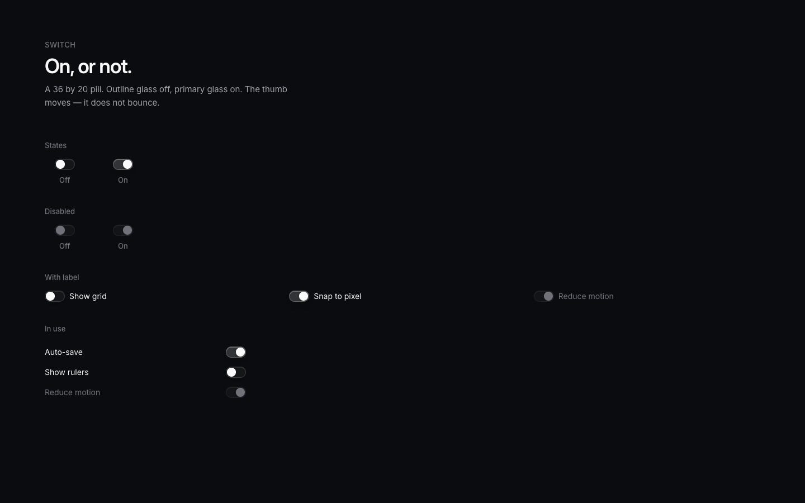 |

### Checkboxes

| Light | Dark |
| --- | --- |
| 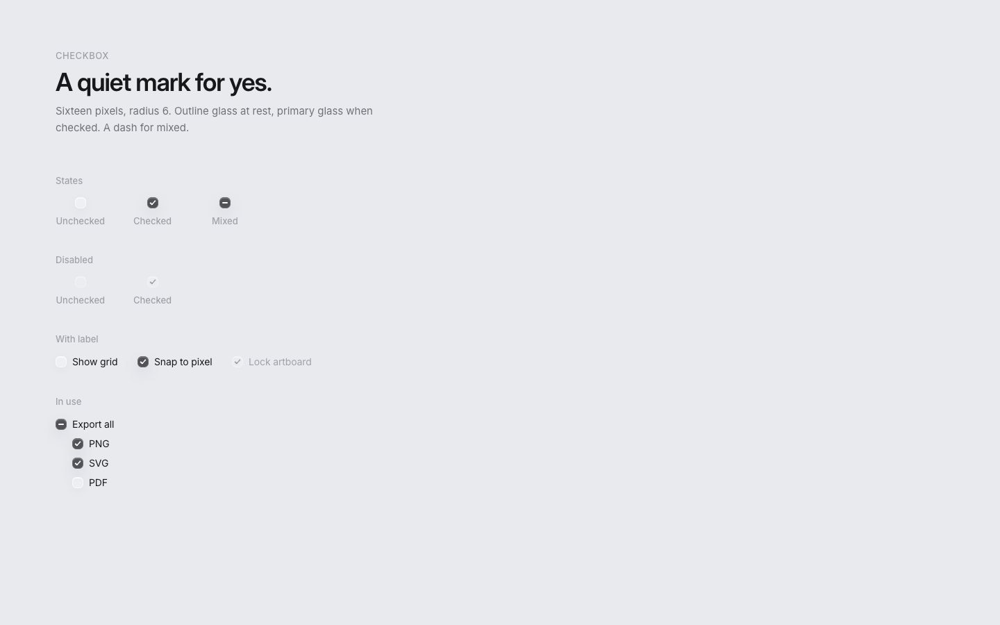 | 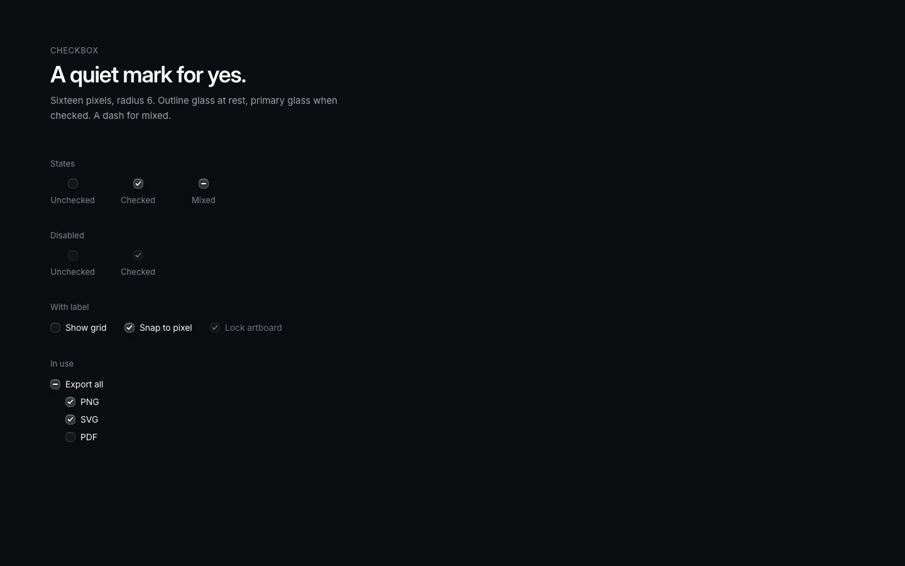 |

### Radios

| Light | Dark |
| --- | --- |
| 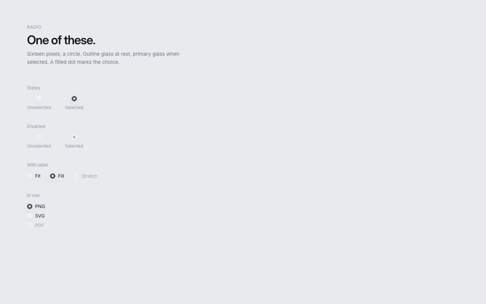 | 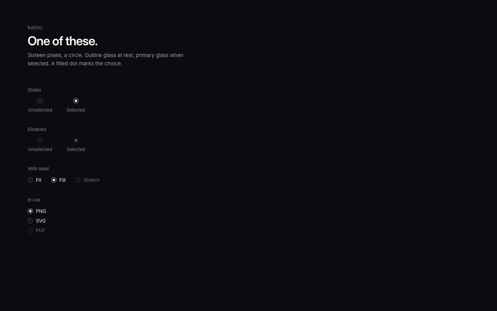 |

### Labels

| Light | Dark |
| --- | --- |
| 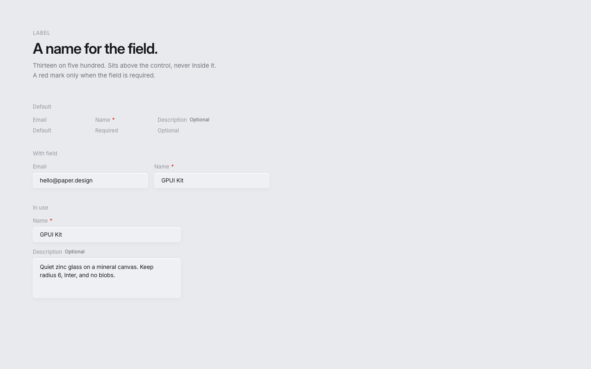 | 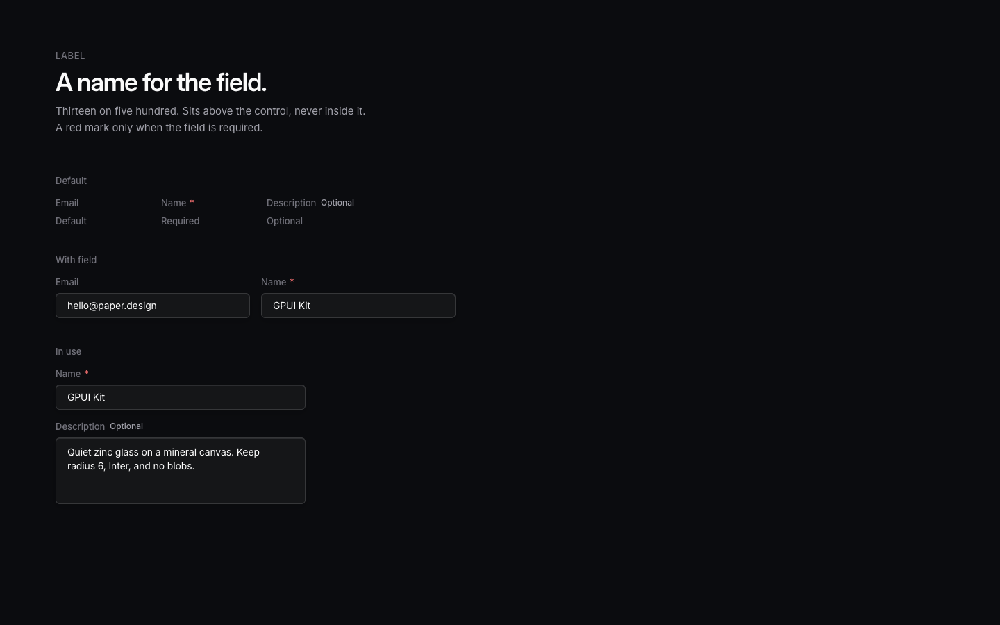 |

### Comboboxes

| Light | Dark |
| --- | --- |
| 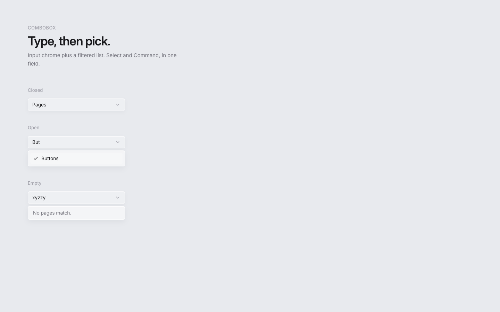 | 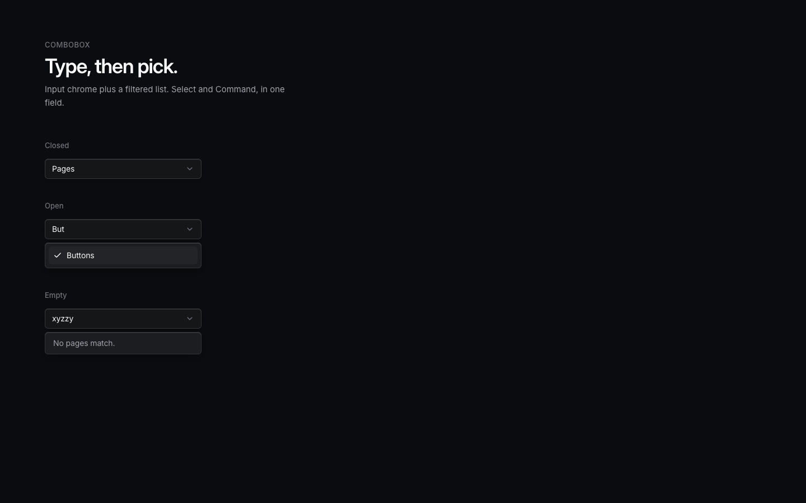 |
