# Overlays

Overlays use `deferred` + `anchored` (or a full-window scrim). Do not parent a menu inside a clipped scroller and hope it escapes.

## Dialog

Controlled. You own `open`.

```rust
Dialog::new("rename")
    .open(self.rename_open)
    .initial_focus(name_focus.clone())
    .focus_cycle([name_focus.clone(), cancel_focus.clone(), save_focus.clone()])
    .on_dismiss(cx.listener(|this, _, cx| {
        this.rename_open = false;
        cx.notify();
    }))
    .child(
        DialogContent::new()
            .child(
                DialogHeader::new()
                    .child(DialogTitle::new("Rename page"))
                    .child(DialogDescription::new("This updates the layer name.")),
            )
            .child(Input::new("page-name").value(self.name.clone()))
            .child(
                DialogFooter::new()
                    .child(Button::new("cancel", "Cancel").variant(ButtonVariant::Ghost))
                    .child(Button::new("save", "Save")),
            ),
    )
```

- Radius 10 secondary glass, dim scrim (not a second glass layer).
- Escape dismisses. Scrim click dismisses unless `.dismiss_on_scrim(false)`.
- Focus is saved on open and restored on close.
- Pass `.focus_cycle(...)` so Tab stays inside the panel.

## Command palette

`Command` is the reusable sheet. The app owns the global shortcut and hosts it in `Dialog`, so opening, scrim dismissal, and focus restoration stay explicit:

```rust
let dialog_owner = cx.entity();
let command_owner = cx.entity();

Dialog::new("command-dialog")
    .open(self.command_open)
    .initial_focus(self.command_focus.clone())
    .on_dismiss(move |_, cx| {
        dialog_owner.update(cx, |this, cx| {
            this.command_open = false;
            cx.notify();
        });
    })
    .child(
        Command::new("command")
            .focus_handle(self.command_focus.clone())
            .groups(command_groups)
            .on_dismiss(move |_, cx| {
                command_owner.update(cx, |this, cx| {
                    this.command_open = false;
                    cx.notify();
                });
            }),
    )
```

Bind Cmd/Ctrl-K as an app action that toggles `command_open`. `glassy_ui::init` installs the search editing and command navigation bindings.

## Alert dialog

Same panel. No field. Cancel is the safe autofocus. Scrim is locked.

```rust
AlertDialog::new("delete-page", "Delete page", "This cannot be undone.")
    .open(self.confirm_open)
    .cancel_label("Cancel")
    .confirm_label("Delete page")
    .on_cancel(cx.listener(|this, _, cx| {
        this.confirm_open = false;
        cx.notify();
    }))
    .on_confirm(cx.listener(|this, _, cx| {
        this.delete_page();
        this.confirm_open = false;
        cx.notify();
    }))
```

Confirm is Destructive. Title is the action.

## Popover

```rust
Popover::new("meta")
    .placement(PopoverPlacement::Bottom) // Top, Bottom, Start, End
    .gap(px(6.))
    .trigger_label("Show page metadata")
    .trigger(info_button)
    .on_open_change(cx.listener(|this, open, _, cx| {
        this.meta_open = open;
        cx.notify();
    }))
    .child(
        PopoverContent::new()
            .child(PopoverTitle::new("Home"))
            .child(PopoverDescription::new("1440 × 900 · 3 layers")),
    )
```

`.open(true)` is controlled. `.default_open(true)` is the gallery seed. Secondary glass, radius 6, origin at the trigger.

## Tooltip

Inverse chip, 24 tall, 300ms delay, 6px from the trigger. Never under the cursor.

```rust
Button::icon_only("export", IconName::Download)
    .variant(ButtonVariant::Ghost)
    .tooltip(
        Tooltip::new("Export PNG")
            .placement(TooltipPlacement::Above) // Below, Start, End
            .show_delay(Duration::from_millis(300)),
    )
```

You can also render `Tooltip::new("Export PNG")` as a visible specimen.

## Dropdown menu

Trigger-anchored, 240 wide, 6px under the trigger.

```rust
DropdownMenu::new("file")
    .trigger_label("Open File menu")
    .trigger(file_button)
    .entries([
        DropdownMenuItem::new("New file").shortcut("⌘N").on_select(on_new).into(),
        DropdownMenuEntry::separator(),
        DropdownMenuItem::new("Export")
            .submenu([
                DropdownMenuEntry::item("PNG"),
                DropdownMenuEntry::item("SVG"),
            ])
            .into(),
        DropdownMenuItem::new("Delete page").destructive(true).on_select(on_delete).into(),
    ])
```

Up/Down skip separators and disabled rows. Right opens a submenu, Left returns, Escape restores trigger focus.

## Context menu

Same items as Dropdown. No trigger. Origin is the pointer.

```rust
ContextMenu::new("page")
    .default_open(false)
    .position(point(px(48.), px(40.))) // local origin when shown without a click
    .entries(file_entries)
    .child(page_surface)
```

Right-click the child to open at `event.position`. Escape and outside click dismiss and restore focus. `.open(true)` is controlled, same as Popover.

## Screenshots

### Dialogs

| Light | Dark |
| --- | --- |
| 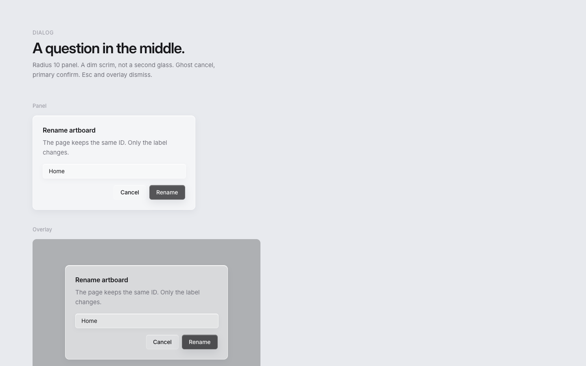 | 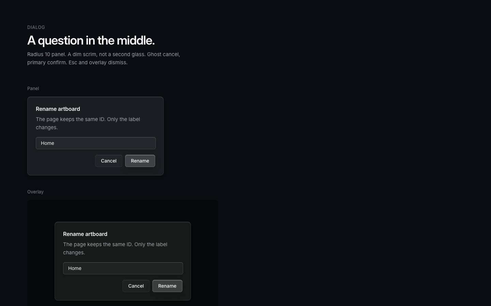 |

### Alert dialogs

| Light | Dark |
| --- | --- |
| 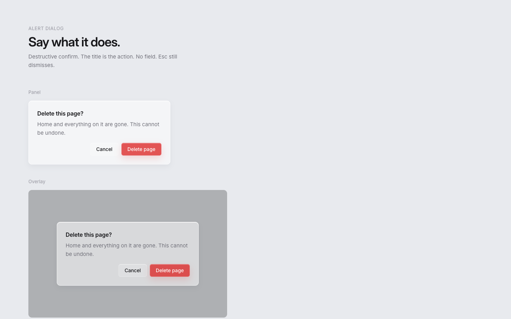 | 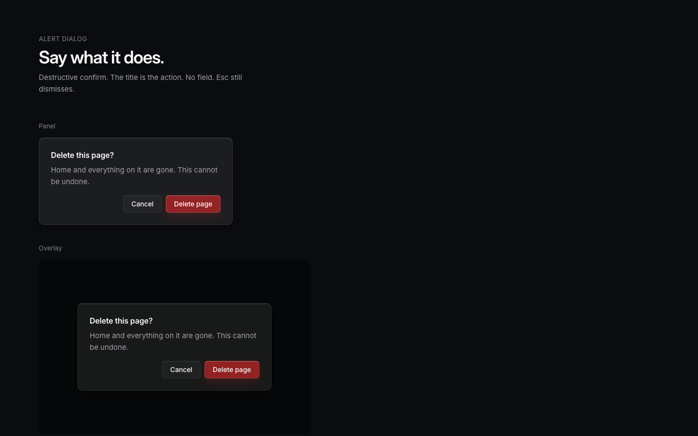 |

### Popovers

| Light | Dark |
| --- | --- |
| 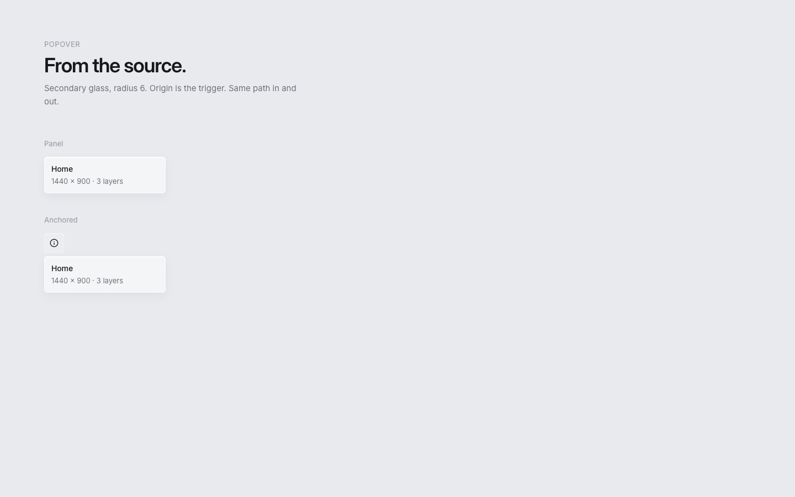 | 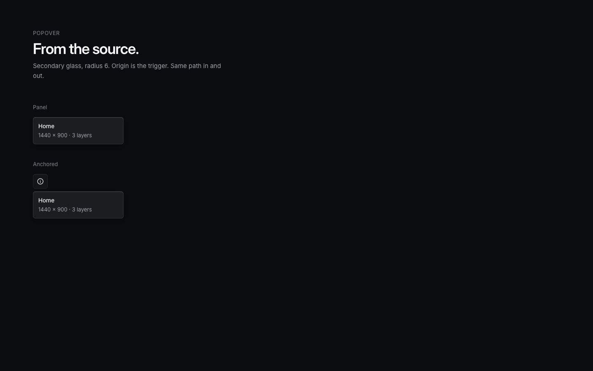 |

### Tooltips

| Light | Dark |
| --- | --- |
| 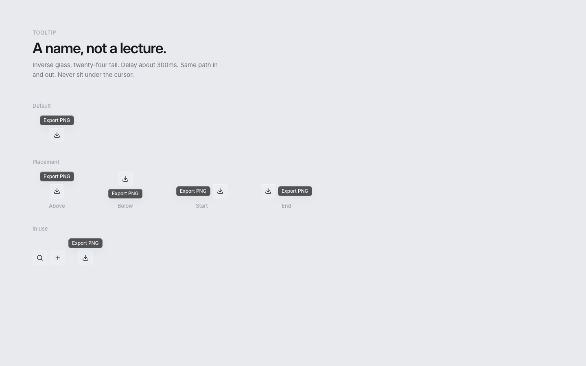 | 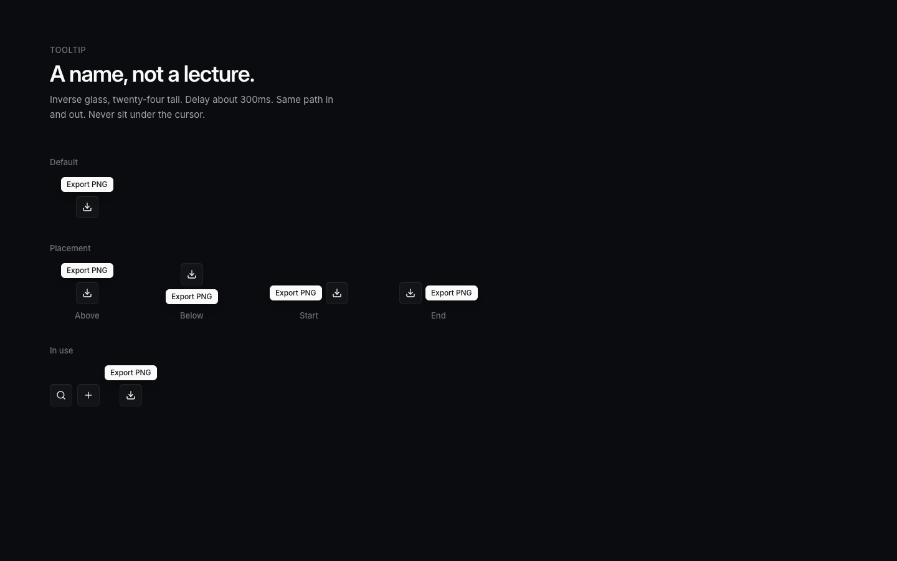 |

### Dropdown menus

| Light | Dark |
| --- | --- |
| 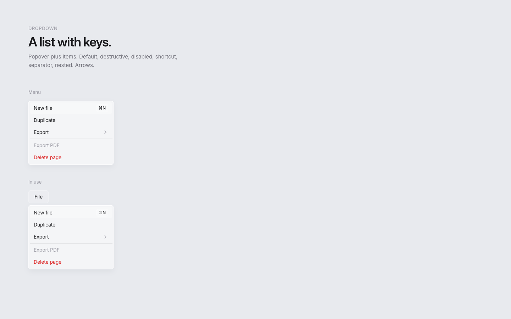 | 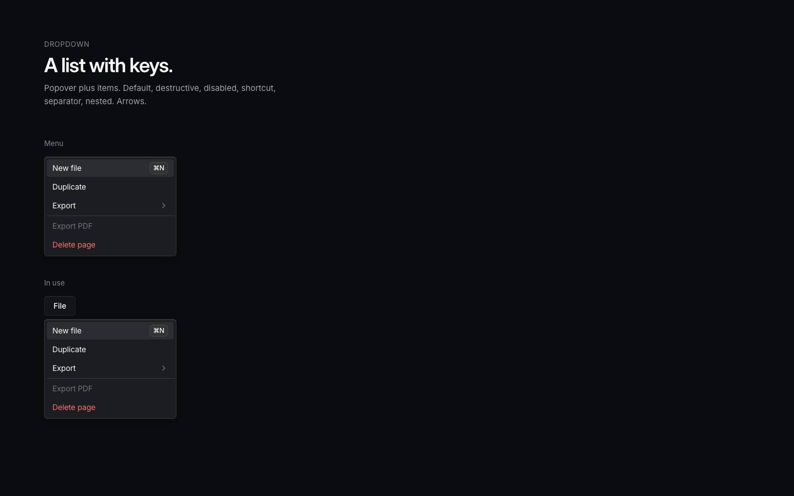 |

### Context menus

| Light | Dark |
| --- | --- |
| 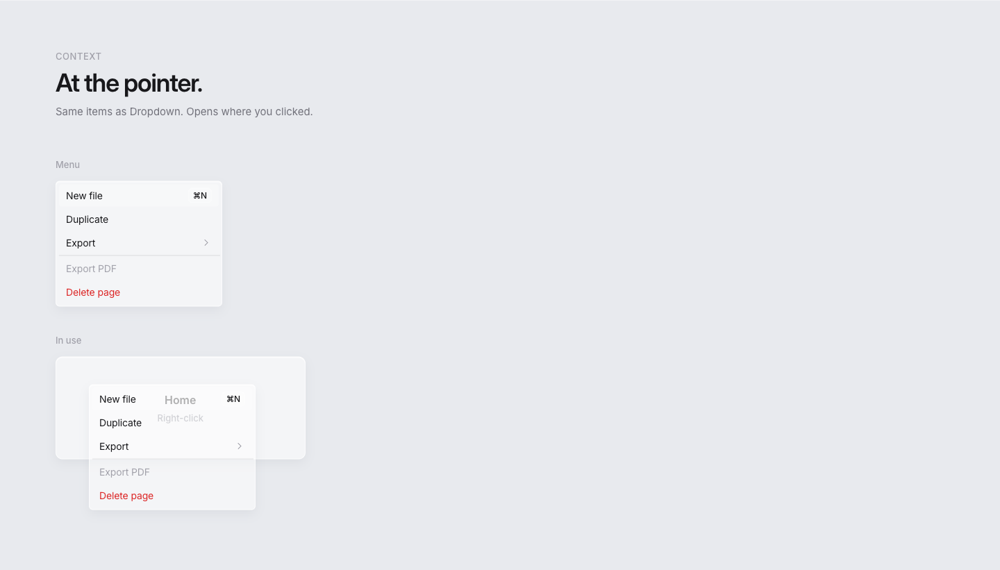 | 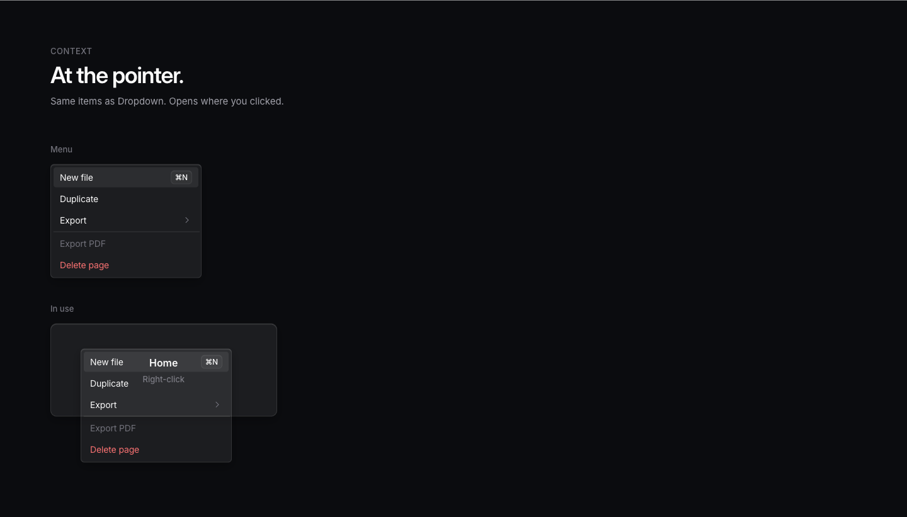 |

### Menubars

| Light | Dark |
| --- | --- |
| 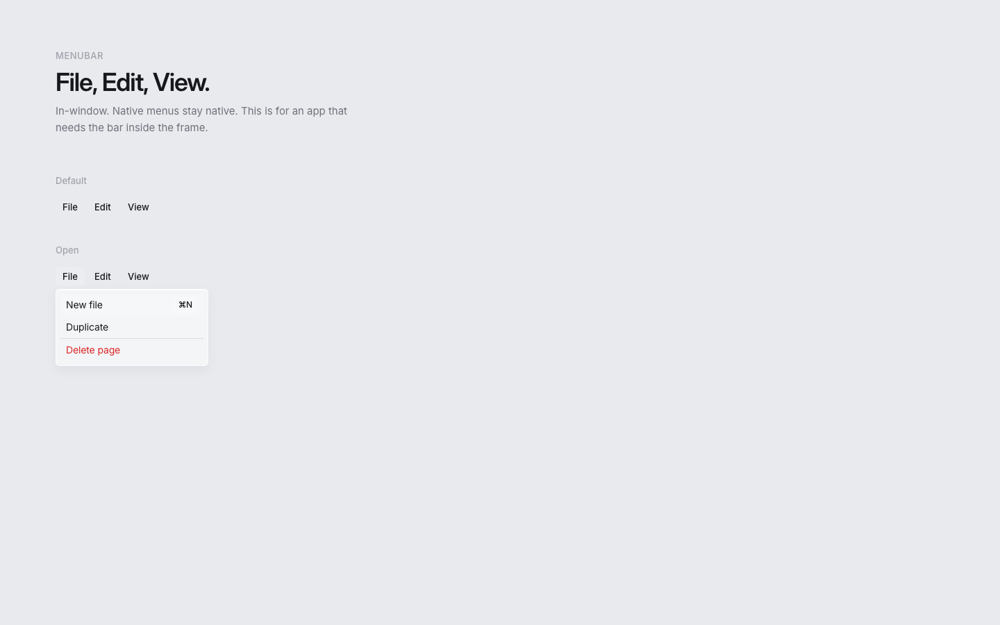 | 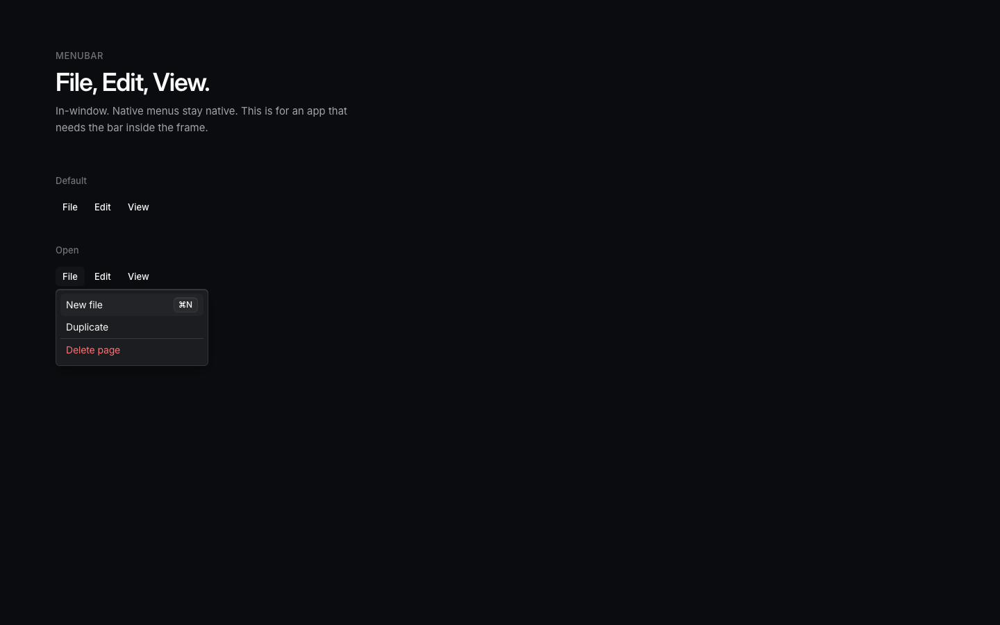 |
