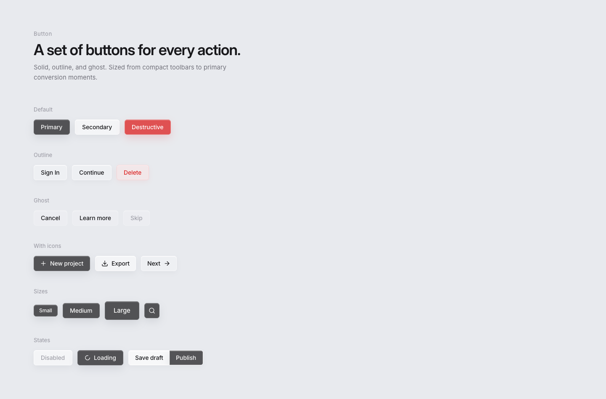
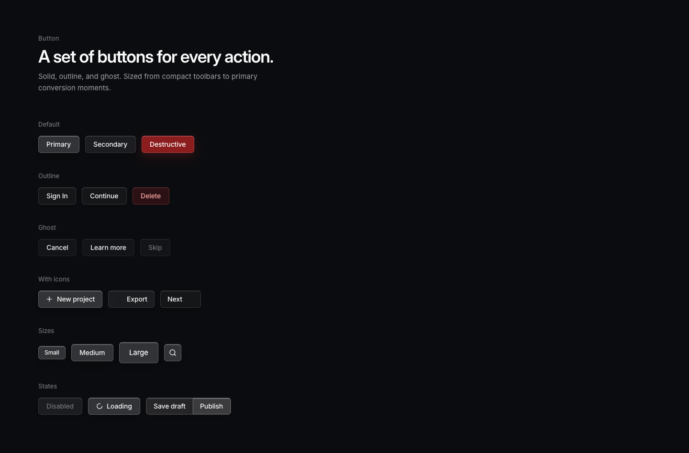

# Theme and chrome

Semantic text and canvas colors live in `theme`. Button fills, rims, inset catch-lights, and shadows live in `chrome`. Do not add a `primary_button_fill` token.

## Semantic tokens

`Theme::light()` / `Theme::dark()`, installed by `init_theme`.

| Token | Light | Dark | Role |
| --- | --- | --- | --- |
| `canvas` | `#E8EAEE` | `#0B0C0F` | Opaque window ground |
| `heading` | `#18181B` | `#FAFAFA` | Page title |
| `ink` | `#18181B` | `#FAFAFA` | Control labels, body actions |
| `body` | `#71717A` | `#A1A1AA` | Supporting copy |
| `label` | `#A1A1AA` | `#71717A` | Eyebrows, captions |
| `on_solid` | `#FAFAFA` | `#FAFAFA` | Type on primary / inverse glass |
| `placeholder` | `#A1A1AA` | `#71717A` | Field placeholder |
| `destructive` | `#DC2626` | `#F87171` | Danger actions |
| `destructive_soft` | `#DC2626` | `#FCA5A5` | Outline-destructive on dark |

`cx.theme()`, `cx.set_theme(Theme::dark())`, `cx.toggle_theme()`. `FONT_FAMILY` is `"Inter Variable"`.

Exact design alphas are `RRGGBB_AA`. Helpers: `rgb(0x18181B)`, `paint(0x18181B_B8)`.

## Theme specimens

| Light | Dark |
| --- | --- |
|  |  |

## Material

Glass is fill + 1px rim + inset 1px highlight + (sometimes) a soft drop shadow. GPUI has no per-control backdrop-filter; on this canvas the design spec blur is nearly a no-op, so alpha + rim + inset is the native material.

Primary is **not** opaque black. Light primary is zinc at 72%. Dark primary **inverts** to white glass.

Hover lifts fill alpha immediately. No scale, bounce, or glow.

Radius is 6 for controls. Panels that are clearly a card (dialog, empty spinner surface) may use 10.

## Motion

Use `glassy_ui::motion`. Do not add another animation stack.

- Default UI springs are critically damped.
- Hover fills are immediate.
- Spinner rotation is linear, 700ms.
- Skeleton pulse holds the first frame when reduced motion is on.
- `Motion::new().surface_in()` / `.selection_in()` are the kit enter presets.

## Icons

Closed set, painted with `text_color`:

`Plus`, `Download`, `Info`, `ChevronRight`, `ChevronDown`, `Search`, `Spinner`, `Check`.

Adding a file under `assets/icons/` is not enough. Update both `AssetSource::load` and `AssetSource::list` in `src/assets.rs`.
